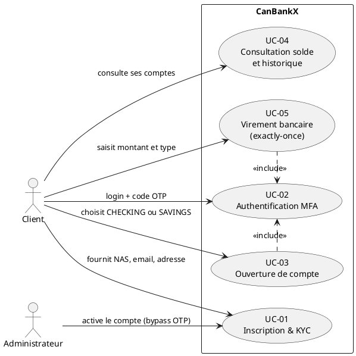
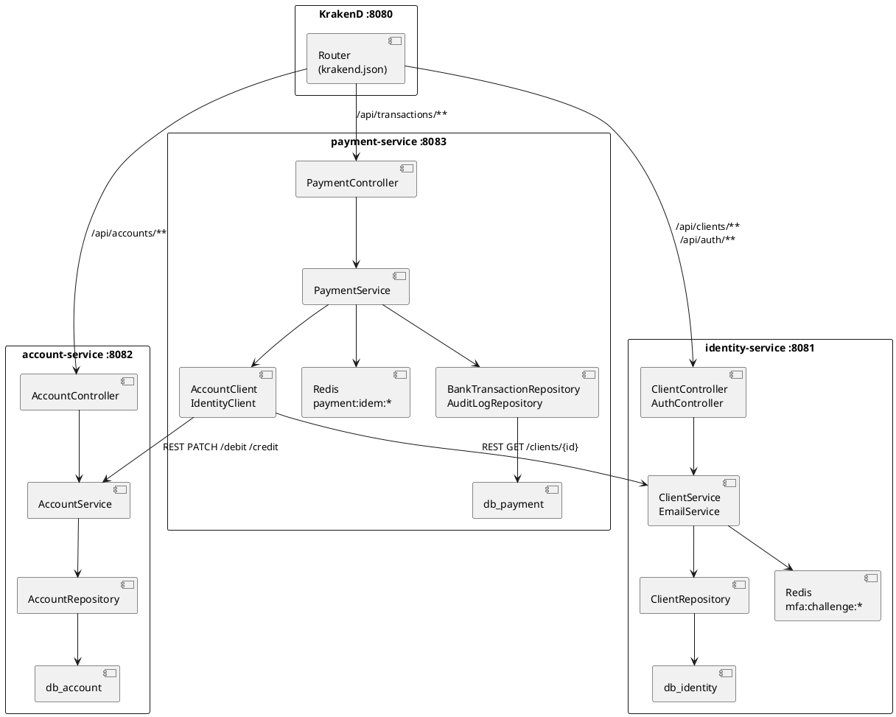
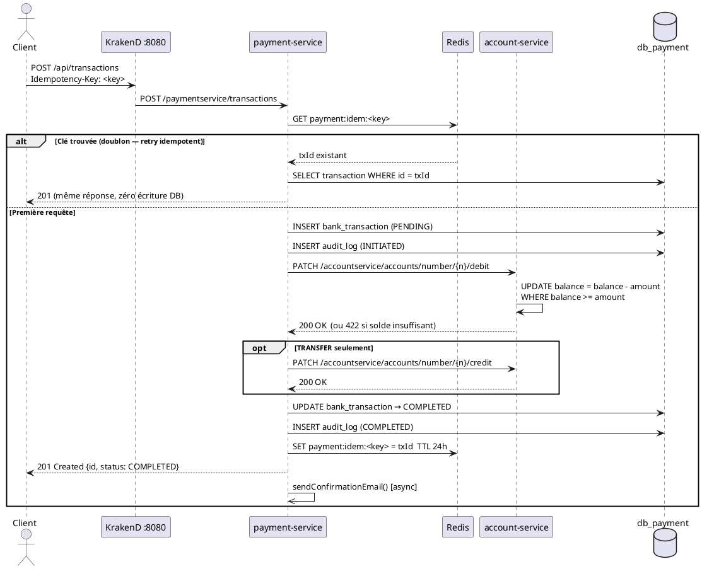
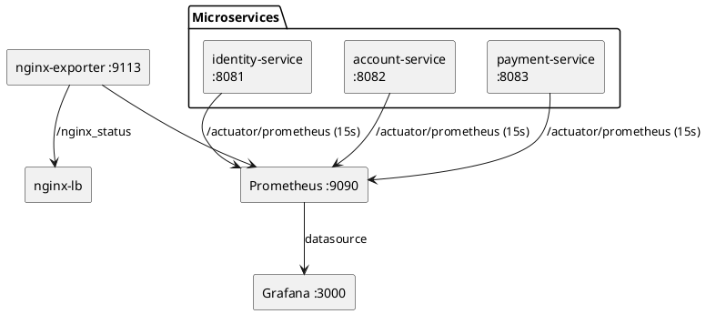
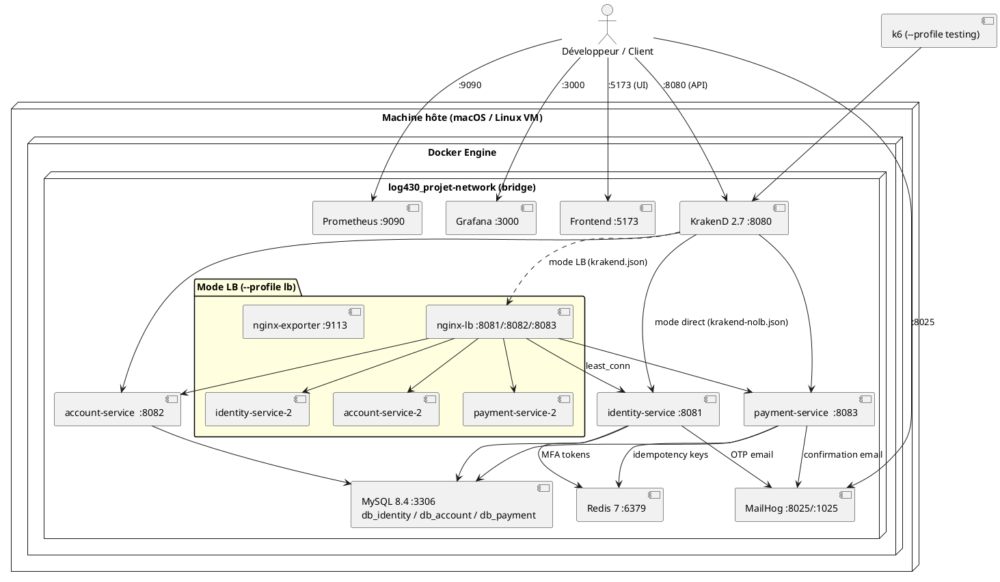

# Vues architecturales 4+1 — CanBankX

**Auteur :** Pascal Bourgoin
**Date :** Mars 2026
**Projet :** LOG430 — Architecture logicielle

> Le modèle 4+1 de Philippe Kruchten décrit l'architecture selon cinq vues complémentaires. Chaque vue répond aux préoccupations d'un groupe de parties prenantes différent.

---

## Table des matières

1. [Vue Scénarios](#1-vue-scénarios--cas-dutilisation)
2. [Vue Logique](#2-vue-logique--modèle-de-domaine)
3. [Vue Processus](#3-vue-processus--flux-dexécution)
4. [Vue Développement](#4-vue-développement--organisation-du-code)
5. [Vue Déploiement](#5-vue-déploiement--infrastructure-docker)

---

## 1. Vue Scénarios — Cas d'utilisation

> **Audience :** toutes les parties prenantes. Sert de fil conducteur pour les quatre autres vues.

La vue scénarios centralise les cas d'utilisation qui pilotent l'architecture. Chaque UC implique au moins un service, une base de données, et valide un ou plusieurs objectifs de qualité.

### Diagramme de cas d'utilisation



*(Source : `docs/UseCaseDiagram.puml`)*

### Tableau récapitulatif

| UC | Acteur | Service(s) | Précondition | Résultat attendu | Objectif qualité |
|---|---|---|---|---|---|
| UC-01 | Client, Admin | identity-service | Aucune | Compte PENDING créé, OTP envoyé | Disponibilité |
| UC-02 | Client | identity-service | Compte ACTIVE | MFA validé, session établie | Sécurité |
| UC-03 | Client | account-service | Compte ACTIVE | Compte CHECKING/SAVINGS créé | Disponibilité |
| UC-04 | Client | account-service + payment-service | Compte existant | Solde + transactions retournés | Performance (p95 < 400 ms) |
| UC-05 | Client | payment-service | 2 comptes, solde suffisant | Transaction COMPLETED, email envoyé | Exactitude (exactly-once) |

### Lien avec les autres vues

| UC | Vue Logique | Vue Processus | Vue Développement |
|---|---|---|---|
| UC-01, UC-02 | `Client`, `Status` | Séquence login MFA | identity-service |
| UC-03, UC-04 | `Account`, `AccountType` | Appel agrégation KrakenD | account-service |
| UC-05 | `BankTransaction`, `AuditLog` | Séquence exactly-once | payment-service |

---

## 2. Vue Logique — Modèle de domaine

> **Audience :** architecte, développeurs. Décrit la structure statique du système — entités, responsabilités, relations.

### Bounded Contexts et isolation

Le système est décomposé en trois bounded contexts DDD. Chaque contexte a son propre service, son propre schéma MySQL et son propre modèle. **Aucun JOIN cross-service n'est permis.** Les références entre contextes se font uniquement par identifiant métier (UUID ou String).

```
+---------------------------+     +---------------------------+     +---------------------------+
|  Identité & Auth          |     |  Gestion des comptes      |     |  Paiements                |
|  identity-service         |     |  account-service          |     |  payment-service          |
|  db_identity              |     |  db_account               |     |  db_payment               |
|                           |     |                           |     |                           |
|  Agrégat : Client         |     |  Agrégat : Account        |     |  Agrégat : BankTransaction|
|  - id (UUID)              |     |  - id (UUID)              |     |  - id (UUID)              |
|  - email (UNIQUE)         |     |  - accountNumber (UNIQUE) |     |  - idempotencyKey (UNIQUE)|
|  - nas (UNIQUE)           |     |  - clientId (ref)         |     |  - sourceAccountNumber    |
|  - passwordHash           |     |  - type                   |     |  - amount                 |
|  - status                 |     |  - balance                |     |  - type / status          |
|                           |     |                           |     |                           |
|  Enum : Status            |     |  Enum : AccountType       |     |  Enum : TransactionType   |
|  PENDING/ACTIVE/SUSPENDED |     |  CHECKING / SAVINGS       |     |  DEBIT/CREDIT/TRANSFER    |
|                           |     |                           |     |                           |
|                           |     |                           |     |  VO : AuditLog            |
|                           |     |                           |     |  (append-only)            |
+---------------------------+     +---------------------------+     +---------------------------+
         |                                   |                                 |
         | clientId (UUID)                   | accountNumber (String)          |
         +---------------------------------->+-------------------------------->+
                        (références sans FK cross-schema)
```

### Diagramme de classes complet

```plantuml
@startuml CanBankX — Modèle de domaine complet

package "identity-service (db_identity)" {
  class Client <<Aggregate Root>> {
    +UUID id
    +String firstName
    +String lastName
    +String email          <<UNIQUE>>
    +String passwordHash   <<BCrypt 8>>
    +String nas            <<UNIQUE>>
    +String phoneNumber
    +String address
    +Status status
    +LocalDateTime createdAt
  }
  enum Status { PENDING  ACTIVE  SUSPENDED }
  Client --> Status
}

package "account-service (db_account)" {
  class Account <<Aggregate Root>> {
    +UUID id
    +String accountNumber  <<UNIQUE>>
    +UUID clientId
    +AccountType type
    +BigDecimal balance
    +LocalDateTime createdAt
  }
  enum AccountType { CHECKING  SAVINGS }
  Account --> AccountType
}

package "payment-service (db_payment)" {
  class BankTransaction <<Aggregate Root>> {
    +UUID id
    +String idempotencyKey  <<UNIQUE>>
    +String sourceAccountNumber
    +String targetAccountNumber
    +BigDecimal amount
    +TransactionType type
    +TransactionStatus status
    +LocalDateTime createdAt
  }
  class AuditLog <<Value Object>> {
    +UUID id
    +UUID transactionId
    +String action
    +String details
    +LocalDateTime createdAt
  }
  enum TransactionType   { DEBIT  CREDIT  TRANSFER }
  enum TransactionStatus { PENDING  COMPLETED  FAILED }
  BankTransaction --> TransactionType
  BankTransaction --> TransactionStatus
  BankTransaction "1" *-- "1..*" AuditLog
}

Client      "1" -- "0..*" Account
Account     "1" -- "0..*" BankTransaction

note right of BankTransaction
  Double filet exactly-once :
  1. Redis TTL 24h
  2. UNIQUE SQL
end note
note right of AuditLog : append-only — jamais UPDATE/DELETE
@enduml
```

*(Source : `docs/ClassDiagram.puml`)*

### Transitions d'état

**Client :**
```
PENDING ──[OTP vérifié / activation admin]──► ACTIVE ──[suspension]──► SUSPENDED
```

**BankTransaction :**
```
PENDING ──[débit+crédit OK]──► COMPLETED
PENDING ──[échec partiel + compensation]──► FAILED
```

---

## 3. Vue Processus — Flux d'exécution

> **Audience :** architecte, développeurs. Décrit les interactions dynamiques entre composants au moment de l'exécution.

### Architecture interne des services

Chaque service suit une architecture en couches classique sans dépendance circulaire :

```
HTTP Request
     │
     ▼
Controller (validation @Valid, mapping DTO)
     │
     ▼
Service (logique métier, transactions @Transactional)
     │
     ▼
Repository (JPA — interface Spring Data)
     │
     ▼
MySQL (via HikariCP, pool de 50 connexions)
```

Les appels inter-services utilisent `RestClient` avec un `JdkClientHttpRequestFactory` partagé (pool TCP persistant). Les emails partent via `CompletableFuture.runAsync()` pour ne pas bloquer la réponse HTTP.

### Diagramme de composants



*(Source : `docs/ComponentDiagram.puml`)*

### Diagramme de séquence — UC-05 Virement (happy path)



*(Source : `docs/SequenceDiagram.puml`)*

### Flux de compensation (panne partielle)

Si le débit réussit mais que le crédit échoue sur un TRANSFER :

```
1. DEBIT source      → 200 OK  (solde débité)
2. CREDIT destination → erreur
3. CREDIT compensation source → restaure le solde
4. transaction → FAILED
5. AuditLog : DEBIT_OK + CREDIT_FAILED + COMPENSATION_OK
```

### Observabilité en temps réel



*(Source : `docs/ObservabilityDiagram.puml`)*

---

## 4. Vue Développement — Organisation du code

> **Audience :** développeurs. Décrit l'organisation des modules, packages et leurs dépendances.

### Structure des modules Maven

```
log430-projet/                         ← parent POM (groupId: com.canbankx)
│
├── common/                            ← module partagé (pas de main, pas de DB)
│   └── src/main/java/com/canbankx/common/
│       ├── ErrorResponse.java         ← DTO d'erreur uniforme {status, error, message, timestamp}
│       └── GlobalExceptionHandler.java ← @RestControllerAdvice — mapping exceptions → HTTP
│
├── identity-service/                  ← UC-01, UC-02
│   └── src/main/java/com/canbankx/identity/
│       ├── controller/
│       │   ├── ClientController.java  ← POST /identityservice/clients, GET, PATCH
│       │   └── AuthController.java   ← POST /identityservice/auth/login, /mfa
│       ├── service/
│       │   ├── ClientService.java    ← inscription, activation, BCrypt, OTP
│       │   └── EmailService.java     ← envoi OTP via JavaMailSender (MailHog)
│       ├── repository/
│       │   └── ClientRepository.java ← JPA — findByEmail, findByNas
│       ├── model/
│       │   ├── Client.java           ← @Entity — agrégat racine
│       │   └── Status.java           ← enum PENDING/ACTIVE/SUSPENDED
│       └── config/
│           ├── SecurityConfig.java   ← STATELESS, CORS, endpoints publics
│           └── OpenApiConfig.java    ← Swagger UI config
│
├── account-service/                   ← UC-03, UC-04
│   └── src/main/java/com/canbankx/account/
│       ├── controller/
│       │   └── AccountController.java ← POST, GET, PATCH /debit, PATCH /credit
│       ├── service/
│       │   └── AccountService.java   ← création, debit/credit @Transactional
│       ├── repository/
│       │   └── AccountRepository.java ← JPA — findByAccountNumber, findByClientId
│       └── model/
│           ├── Account.java           ← @Entity — agrégat racine
│           └── AccountType.java       ← enum CHECKING/SAVINGS
│
├── payment-service/                   ← UC-05
│   └── src/main/java/com/canbankx/payment/
│       ├── controller/
│       │   └── PaymentController.java ← POST /transactions, GET
│       ├── service/
│       │   ├── PaymentService.java   ← orchestration exactly-once, compensation
│       │   └── EmailService.java     ← confirmation email (async)
│       ├── client/
│       │   ├── AccountClient.java    ← RestClient → account-service (ACL)
│       │   └── IdentityClient.java   ← RestClient → identity-service (ACL)
│       ├── repository/
│       │   ├── BankTransactionRepository.java ← findByIdempotencyKey
│       │   └── AuditLogRepository.java        ← save() uniquement (append-only)
│       └── model/
│           ├── BankTransaction.java   ← @Entity — agrégat racine
│           ├── AuditLog.java          ← @Entity — value object immuable
│           ├── TransactionType.java   ← enum DEBIT/CREDIT/TRANSFER
│           └── TransactionStatus.java ← enum PENDING/COMPLETED/FAILED
│
├── krakend/
│   ├── krakend.json                   ← config API Gateway mode LB
│   └── krakend-nolb.json              ← config API Gateway mode direct
│
├── nginx/
│   └── nginx-all.conf                 ← upstream pools least_conn, keepalive
│
├── k6/
│   ├── smoke-test.js                  ← 1 VU, 1 itération, 41 checks
│   ├── load-test.js                   ← 50 VUs, 4 min, 3 scénarios
│   └── stress-test.js                 ← 200 VUs, 6.5 min, pool 20 comptes
│
├── .github/workflows/
│   ├── ci.yml                         ← build-java + build-frontend en parallèle
│   └── cd.yml                         ← SSH → VM → git pull + docker compose
│
├── prometheus/config.yml              ← scrape_configs (15s, 6 targets)
├── grafana/dashboards/canbankx.json   ← dashboard 4 Golden Signals auto-provisionné
├── db-init/init.sql                   ← CREATE DATABASE + GRANT (idempotent)
└── docker-compose.yaml                ← orchestration complète (profils: lb, testing)
```

### Règles de dépendances

```
common ◄── identity-service
common ◄── account-service
common ◄── payment-service

identity-service  ─┐
account-service   ─┤  NE s'importent JAMAIS mutuellement
payment-service   ─┘  (communication uniquement via HTTP REST)
```

Cette règle est enforced par Maven : le `pom.xml` de chaque service ne déclare qu'une dépendance vers `common`. Aucun service ne peut importer les classes d'un autre service.

### Conventions de nommage

| Couche | Convention | Exemple |
|---|---|---|
| Controller | `{Domaine}Controller` | `PaymentController` |
| Service | `{Domaine}Service` | `PaymentService` |
| Repository | `{Entité}Repository` | `BankTransactionRepository` |
| DTO request | `{Action}Request` | `CreateTransactionRequest` |
| DTO response | `{Entité}Response` | `TransactionResponse` |
| Client REST | `{Service}Client` | `AccountClient` |
| Endpoint interne | `/{service}/{ressource}` | `/paymentservice/transactions` |
| Endpoint Gateway | `/api/{ressource}` | `/api/transactions` |

---

## 5. Vue Déploiement — Infrastructure Docker

> **Audience :** ops, architecte. Décrit la topologie d'exécution — conteneurs, réseaux, volumes, ports.

### Diagramme de déploiement



*(Source : `docs/DeploymentDiagram.puml`)*

### Modes de déploiement

| Mode | Commande | Instances | Usage |
|---|---|---|---|
| **Direct** (défaut) | `docker compose up -d` | 1 par service | Développement, démo |
| **LB** | `KRAKEND_CONFIG=krakend.json docker compose --profile lb up -d` | 2 par service | Tests de charge, production |
| **Testing** | `docker compose --profile testing run --rm k6 run /tests/<script>.js` | k6 seulement | Campagnes k6 dans le réseau Docker |

### Ports exposés

| Service | Port hôte | Port conteneur | Protocole |
|---|---|---|---|
| KrakenD (API Gateway) | 8080 | 8080 | HTTP |
| identity-service | 8081 | 8081 | HTTP |
| account-service | 8082 | 8082 | HTTP |
| payment-service | 8083 | 8083 | HTTP |
| Frontend | 5173 | 3000 | HTTP |
| MySQL | 3306 | 3306 | TCP |
| Redis | 6379 | 6379 | TCP |
| Prometheus | 9090 | 9090 | HTTP |
| Grafana | 3000 | 3000 | HTTP |
| MailHog SMTP | 1025 | 1025 | SMTP |
| MailHog UI | 8025 | 8025 | HTTP |

### Pipeline CI/CD

```
Développeur
    │  git push main
    ▼
GitHub Actions — CI (ubuntu-latest)
    ├── build-java   : ./mvnw compile + package -DskipTests
    └── build-frontend : npm install + npm run build
    │
    │  CI réussi
    ▼
GitHub Actions — CD (ubuntu-latest)
    │  SSH → VM Linux
    ├── git pull origin main
    ├── écriture .env (secrets GitHub)
    ├── docker network create (si absent)
    ├── docker compose down --remove-orphans
    ├── docker compose up -d --build
    └── curl healthchecks (KrakenD + 3 services)
    │
    ▼
VM Linux — stack CanBankX opérationnelle
```

### Volumes Docker

| Volume | Contenu | Persisté |
|---|---|---|
| `mysql_data` | Données MySQL (3 schémas) | Oui |
| `redis_data` | Données Redis (AOF) | Oui |
| `prometheus_data` | Métriques Prometheus | Oui |
| `grafana_data` | Dashboards Grafana | Oui |

---

*Document généré le 8 mars 2026 — Pascal Bourgoin — LOG430 Hiver 2026*
